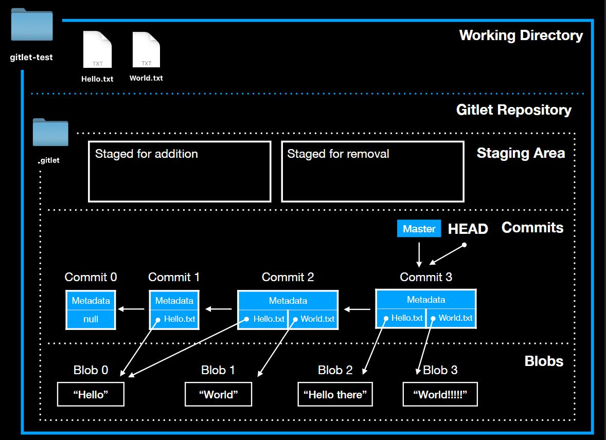

# Gitlet
## 〇、项目概述
用Java实现的一个Git版本管理系统。
使用IntelliJ IDEA开发，测试中使用了集成测试和JVM进行调试。
## 一、内部结构
现实中的Git本质上是一个key-value的数据库 + 哈希树形成的有向无环图。

Gitlet的实现部分参考了真实Git的内部实现，其中部分命令是简化了的。和真实Git最大的差异在于Staging Area/Index，也就是
暂存区的逻辑上，并由此导致了在此基础上实现的`add`, `commit`等命令也与真实Git的底层原理有所不同。

Gitlet中有几个重要的对象：Commit, Blob, Index。当然还有Branch等其他对象，但这三个是实现的基础。 <br>
### Blob
Blob对象是最底层的，存储着文件们的内容，不包含文件的其他诸如文件名等信息。每个Blob对象的文件名是自身内容的SHA-1 value，而自身内容来自于用户所要添加到暂存区的文件的内容本身。<br>
当用户输入`java gitlet.Main add [filename]`以后，blobs路径下被添加一个新的blob对象，
Staging Area中添加了一个新的键值对。<br>
由于Gitlet存储着文件的众多版本，因此一个文件本身，在不同的commit节点中，可能会对应着多个Blob对象（因为不同版本中这个文件有不同的内容）。
### Commit
Commit是很好理解的，包含message，timestamp，parent，
fileToBlob（指当前commit所追踪的文件，是一个HashMap，key为文件名， value为该文件内容所对应的SHA-1值）这几个属性。
### Index
负责把正在stage的文件所对应的文件名和相应的Blob对象的文件名分别作为key和value存进Staging Area中。Staging Area在我的实现中是一个Hash Map数据结构。

<br>最后，Gitlet实现中有几个重要特性：
- 一是仓库中的对象是content addressable的，通过SHA-1算法来实现。
- 二是为了避免同一内容的反复序列化，需要把所有抽象设计中的pointer以字符串的形式进行存储。

## 二、实现命令
1. `init`<br>
在当前目录下创建一个Gitlet版本管理系统。同时自动提交一个初始commit。<br>
Gitlet初始化后，.gitlet/内部结构如下：<br>
.gitlet/ <br>
   |-- blobs <br>
   |-- index <br>
   |-- commits <br>
   |-- HEAD <br>
   |-- Branch-heads <br>
2. `add`<br>
`java gitlet.Main add [file name]`把该文件添加到Staging area，区分为staged for addition和staged for removal
两种情况。<br>
如果当前工作目录中的文件和要添加的文件内容是一致的，那么不要stage这个文件。
并且，如果该文件已经存在于暂存区里，那么还要把这个文件从中移除。
3. `commit`
默认情况下新的commit节点内容来源于其父节点，而后根据Staging area中的index内容对新节点所追踪的文件存储进行修改。
当然也会修改相关的metadata。
在merge的情况下，需要merge进来的分支头commit节点称为新merge commit的第二个父节点。
4. `checkout` 根据输入的参数不同有3中情况：<br>
`java gitlet.Main checkout -- [file name]`，把当前HEAD commit中该文件所对应的内容覆写到工作目录.
<br> `java gitlet.Main checkout [commit id] -- [file name]` ， 把给定commit中该文件所对应的内容覆写到工作目录。
<br>`java gitlet.Main checkout [branch name]`， 把该分支头节点的所有文件内容覆写到工作目录。并且将暂存区清空。

5. `log` 从当前HEAD节点开始，顺着当前的branch依次展示每个commit节点的相关信息。
在有merge commit的情况中，忽略其第二个父节点。
6. `rm`<br>
`java gitlet.Main rm [file name]` 
如果该文件存在于暂存区，撤销它；如果被当前commit追踪，那么从当前工作目录删除它并且stage it for removal。
7. `global-log` 与`log`命令类似，只不过是展示了所有commit节点的内容。
8. `branch` <br> `java gitlet.Main branch [branch name]`用给定的分支名称创建一个新分支，指向当前commit节点。
9. `find` <br>
`java gitlet.Main find [commit message]` 展示所有message内容为此信息的commit。
10. `status` 看个例子：<br>
`java gitlet.Main status`
```
=== Branches ===
*master
other-branch

=== Staged Files ===
wug.txt
wug2.txt

=== Removed Files ===
goodbye.txt

=== Modifications Not Staged For Commit ===
junk.txt (deleted)
wug3.txt (modified)

=== Untracked Files ===
random.stuff
```

11. `rm-branch`<br>`java gitlet.Main rm-branch [branch name]` 删除给定名称的分支，是指删除该分支所对应的pointer，而非分支上的commit节点。
12. `reset`<br> `java gitlet.Main reset [commit id]` 把给定commit的所有文件内容覆写到当前工作目录。类似于`checkout`命令中的第3个，只不过把branch分支头换成
了给定的commit节点。
13. `merge`
<br> 这个是比较复杂的命令。<br>`java gitlet.Main merge [branch name]`, 根据给定分支头节点、当前节点和双方的split point
中文件的修改、删除情况，可以归纳出8条合并的规则，由此进行分支的合并。
## 三、Demo

[](./git-demo.gif)

## 四、总结与反思
两部分，实现过程中和测试过程中。

## // TODO：
