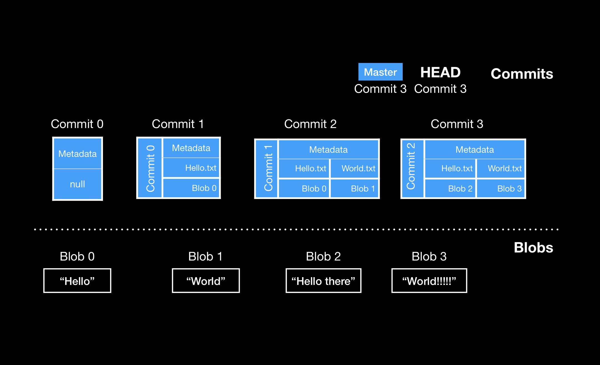

# Gitlet Design Record

**Name**: cyc

## Checkpoint
**Time**: 12/6

**Status0**: Today is Tuesday. Finish Checkpoint part before this week ends! I have 6 commands to implement.

**Status1**: 12/11, finish a rough version of init. Stop here today.

**Status2**: 12/16, learn about how git works deeply -- what's inside objects? Blob, Tree, Commit.

**Status3**: 1/19,复健。Test的地方在d:/gitletTest.先去proj2里面`javac gitlet/*.java`， 
然后 `cp gitlet/*.class d:/gitletTest/gitlet`, 这样就把项目里编译好的class文件都复制了一份到我的
safe playground哈。
### * 1. init

 **init** creates a new Gitlet version-control system in the current directory. This system will automatically start with one commit(with the message 'initial commit'').
1. √ I want to write this init method, but where should I write it? 

2. √ Since init will create the initial commit, ~~maybe I should let init be an instance method in the Commit Class?~~

According to 'Get started' video2, init method should be in the Repository Class. And it's reasonable.
3. √ So let me try writing Commit first.
4. When initializing a .gitlet repository, the HEAD and Master pointer should also be made. How?
5. in this init method, I also have to create all the structure of the .gitlet/

In real .git/, the structure is:

    *  -- COMMIT_EDITMSG
    *  -- HEAD
    *  -- config
    *  -- description
    *  -- index
    *  -- hooks/
    *  -- info/
    *  -- objects/
    *  -- logs/
    *  -- refs/

Right now I just want to implement add and commit, so I just focus on index and objects/ for now.

### * 2. add

1. I think this method, like init, should also be written in Repository.
2. In order to add, first I need a staging area. Where should this functionality be?
Well, maybe in the init method, you know, when you initialize a repository, it should have a staging area in it.

3. Have to first figure out how the whole structure of .gitlet should look like. What objects should I save?

The spec note says, "a careful selection of internal data structures will make the implementation easier or
harder, so it behooves you to spend time planning and thinking about **the best way to store everything**".

Let me try to structure it for the first time.
Besides Commit, I should also have two other classes -- Blob ~~and Tree~~.
No, the spec says "Gitlet simplifies Git by incorporating trees into commits and
not dealing with subdirectories.". So there'll be no Tree objects in Gitlet.
Fine, now I have to reconsider my plan.

### * 3. commit

1. √ Commit should be an object.
2. √ A commit should be serialized, but where? In the constructor or in other method that calls this constructor?
Now I put this serializing part in the latter one, it's reasonable.
3. A commit object should have: message, timestamp, what file it tracks (the file has which blob), parent,
and SHA-1 id
4. The spec says "The staging area is cleared after a commit.". Right now, according
to my current plan, I disagree with this. We'll see later.

### * 4. checkout -- [file name]
### * 5. checkout [commid id] -- [file name]
### * 6. log

